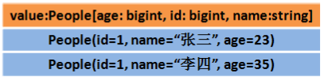

# Spark SQL数据抽象

## 1.1.DataFrame

### ●什么是DataFrame

DataFrame的前身是SchemaRDD，从Spark 1.3.0开始SchemaRDD更名为DataFrame。并不再直接继承自RDD，而是自己实现了RDD的绝大多数功能。

DataFrame是一种以RDD为基础的分布式数据集，类似于传统数据库的二维表格，带有Schema元信息(可以理解为数据库的列名和类型)

### ●总结:

DataFrame ==>  RDD - 泛型 + Schema + 方便的SQL操作 + 优化 

DataFrame是特殊的RDD

DataFrame是一个分布式的表

## 1.2.DataSet

### ●DataSet

DataSet是在Spark1.6中添加的新的接口。

与RDD相比，保存了更多的描述信息，概念上等同于关系型数据库中的二维表。

与DataFrame相比，保存了类型信息，是强类型的，提供了编译时类型检查，

调用Dataset的方法先会生成逻辑计划，然后被spark的优化器进行优化，最终生成物理计划，然后提交到集群中运行！

DataSet包含了DataFrame的功能，

Spark2.0中两者统一，DataFrame表示为DataSet[Row]，即DataSet的子集。

DataFrame其实就是Dateset[Row]

### ●总结:

==Dateset ==> DataFrame + 泛型==

==Dateset ==> RDD + Schema + 方便的SQL操作 + 优化==

==Dateset是特殊的DataFrame、DataFrame是特殊的RDD==

==Dateset是一个分布式的表==

## 1.3. RDD、DataFrame、DataSet的区别

●结构图解

### RDD[Person]

以Person为类型参数，但不了解 其内部结构。

### DataFrame

提供了详细的结构信息schema列的名称和类型。这样看起来就像一张表了

### DataSet[Person]

不光有schema信息，还有类型信息

●数据图解

1.假设RDD中的两行数据长这样：

RDD[Person]

2.那么DataFrame中的数据长这样

DataFrame = RDD[Person] - 泛型 + Schema + SQL操作 + 优化

3.那么Dataset中的数据长这样:

Dataset[Person] = DataFrame + 泛型 

4.Dataset也可能长这样:Dataset[Row]

DataFrame = DataSet[Row]

## 1.4.总结

DataFrame = RDD - 泛型  +  Schema  + SQL + 优化

DataSet = DataFrame  + 泛型

DataSet  =  RDD   +  Schema  + SQL + 优化

DataFrame = DataSet[Row]