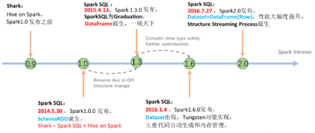

#   数据分析方式

## 1.1.1.  命令式

在前面的 RDD 部分, 非常明显可以感觉的到是命令式的, 主要特征是通过一个算子, 可以得到一个结果, 通过结果再进行后续计算.

sc.textFile("...")

  .flatMap(_.split(" "))

  .map((_, 1))

  .reduceByKey(_ + _)

  .collect()

●命令式的优点

操作粒度更细，能够控制数据的每一个处理环节

操作更明确，步骤更清晰，容易维护

支持半/非结构化数据的操作

●命令式的缺点

需要一定的代码功底

写起来比较麻烦

 

###  SQL

对于一些数据科学家/数据库管理员/DBA, 要求他们为了做一个非常简单的查询, 写一大堆代码, 明显是一件非常残忍的事情, 所以 SQL on Hadoop 是一个非常重要的方向.

SELECT

   name,

   age,

   school

FROM students

WHERE age > 10

●SQL的优点

表达非常清晰, 比如说这段 SQL 明显就是为了查询三个字段，条件是查询年龄大于 10 岁的

●SQL的缺点

试想一下3层嵌套的 SQL维护起来应该挺力不从心的吧

试想一下如果使用SQL来实现机器学习算法也挺为难的吧

 

### 总结

SQL 擅长数据分析和通过简单的语法表示查询，命令式操作适合过程式处理和算法性的处理.

在 Spark 出现之前，对于结构化数据的查询和处理， 一个工具一向只能支持 SQL 或者命令式，使用者被迫要使用多个工具来适应两种场景，并且多个工具配合起来比较费劲.

而 Spark 出现了以后，统一了两种数据处理范式是一种革新性的进步.

## 1.2.        SparkSQL前世今生

SQL 是数据分析领域一个非常重要的范式，所以 Spark 一直想要支持这种范式，而伴随着一些决策失误，这个过程其实还是非常曲折的

### 1.1.1.   发展历史




●Hive

解决的问题

Hive 实现了 SQL on Hadoop，使用 MapReduce 执行任务

简化了 MapReduce 任务

新的问题

Hive 的查询延迟比较高，原因是使用 MapReduce 做计算

●Shark

解决的问题

Shark 改写 Hive 的物理执行计划， 使用 Spark代替MapReduce 物理引擎

使用列式内存存储

以上两点使得 Shark 的查询效率很高

新的问题

Shark执行计划的生成严重依赖 Hive，想要增加新的优化非常困难

Hive 是进程级别的并行，Spark 是线程级别的并行，所以 Hive 中很多线程不安全的代码不适用于 Spark

由于以上问题，Shark 维护了 Hive 的一个分支，并且无法合并进主线，难以为继

在2014年7月1日的Spark Summit上，Databricks宣布终止对Shark的开发，将重点放到Spark SQL上。

 

●SparkSQL-DataFrame 

解决的问题

Spark SQL 执行计划和优化交给优化器 Catalyst

内建了一套简单的SQL解析器，可以不使用HQL

还引入和 DataFrame 这样的DSL API，完全可以不依赖任何 Hive 的组件

新的问题

对于初期版本的SparkSQL，依然有挺多问题，例如只能支持SQL的使用，不能很好的兼容命令式，入口不够统一等

●SparkSQL-Dataset

SparkSQL 在 1.6 时代，增加了一个新的 API，叫做 Dataset，Dataset 统一和结合了 SQL 的访问和命令式 API 的使用，这是一个划时代的进步

在 Dataset 中可以轻易的做到使用 SQL 查询并且筛选数据，然后使用命令式 API 进行探索式分析

### 1.1.2.   Hive和SparkSQL

 

Hive是将SQL转为MapReduce

SparkSQL可以理解成是将SQL解析成'RDD' + 优化再执行


## 1.2.        数据分类和SparkSQL适用场景

### 1.2.1.  结构化数据

一般指数据有固定的 Schema(约束)，例如在用户表中，name 字段是 String 型，那么每一条数据的 name 字段值都可以当作 String 来使用


### 1.2.2.  半结构化数据

一般指的是数据没有固定的 Schema，但是数据本身是有结构的

●没有固定 Schema

指的是半结构化数据是没有固定的 Schema 的，可以理解为没有显式指定 Schema
 比如说一个用户信息的 JSON 文件，

第1条数据的phone_num 有可能是数字，

第2条数据的phone_num 虽说应该也是数字，但是如果指定为String，也是可以的
 因为没有指定 Schema，没有显式的强制的约束

●有结构

虽说半结构化数据是没有显式指定 Schema 的，也没有约束，但是半结构化数据本身是有有隐式的结构的，也就是数据自身可以描述自身
 例如 JSON 文件，其中的某一条数据是有字段这个概念的，每个字段也有类型的概念，所以说 JSON 是可以描述自身的，也就是数据本身携带有元信息

 ```json
{
     "firstName": "John",
     "lastName": "Smith",
     "age": 25,
     "phoneNumber":
     [
         {
           "type": "home",
           "number": "212 555-1234"
         },
         {
           "type": "fax",
           "number": "646 555-4567"
         }
     ]
 }

 ```

### 1.2.3.  总结

●数据分类总结

|              | 定义                          | 特点                                              | 举例                              |
| ------------ | ----------------------------- | ------------------------------------------------- | --------------------------------- |
| 结构化数据   | 有固定的 Schema               | 有预定义的 Schema                                 | 关系型数据库的表                  |
| 半结构化数据 | 没有固定的 Schema，但是有结构 | 没有固定的 Schema，有结构信息，数据一般是自描述的 | 指一些有结构的文件格式，例如 JSON |
| 非结构化数据 | 没有固定 Schema，也没有结构   | 没有固定 Schema，也没有结构                       | 指图片/音频之类的格式             |

 

●Spark处理什么样的数据?

RDD主要用于处理非结构化数据 、半结构化数据、结构化

SparkSQL主要用于处理结构化数据(较为规范的半结构化数据也可以处理)

 

●SparkSQL 相较于 RDD 的优势在哪?

1.SparkSQL 提供了更好的外部数据源读写支持

2.SparkSQL 提供了直接访问列的能力

 

●总结: 

SparkSQL 是一个既支持 SQL 又支持命令式数据处理的工具

SparkSQL 的主要适用场景是处理结构化数据(较为规范的半结构化数据也可以处理)

## 1.3.        Spark SQL官方介绍

●官网

http://spark.apache.org/sql/


Spark SQL是Spark用来处理结构化数据的一个模块。

Spark SQL还提供了多种使用方式，包括DataFrames API和Datasets API。但无论是哪种API或者是编程语言，它们都是基于同样的执行引擎，因此你可以在不同的API之间随意切换，它们各有各的特点，看你喜欢。

 

●Spark SQL 的特点

1.易整合

可以使用java、scala、python、R等语言的API操作。


2.统一的数据访问

连接到任何数据源的方式相同。


3.兼容Hive

支持hiveHQL的语法。

兼容hive(元数据库、SQL语法、UDF、序列化、反序列化机制)


4.标准的数据连接

可以使用行业标准的JDBC或ODBC连接。


 