# 初识Spark SQL

## 1-SparkSession

●在spark2.0版本之前

SQLContext是创建DataFrame和执行SQL的入口

HiveContext通过hive sql语句操作hive表数据，兼容hive操作，hiveContext继承自SQLContext。


●在spark2.0之后

这些都统一于SparkSession，SparkSession 封装了SqlContext及HiveContext

实现了SQLContext及HiveContext所有功能

通过SparkSession还可以获取到SparkConetxt

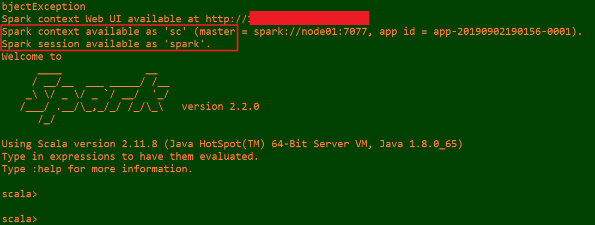 

## 2-创建DataFrame

### 1-创建读取文本文件

#### 1-在本地创建一个文件

​		有id、name、age三列，用空格分隔，然后上传到hdfs上

```properties
vim /root/person.txt

//person数据
   1 zhangsan 20 
   2 lisi 29  
   3 wangwu 25  
   4 zhaoliu 30  
   5 tianqi 35  
   6 kobe 40 
```

上传数据文件到HDFS上：

```properties
hadoop fs -put /root/person.txt  /
```


#### 2-打开spark-shell-读取数据-数据使用列分隔符分割

```shell
/export/servers/spark/bin/spark-shell 
```

创建RDD

```scala
val lineRDD= sc.textFile("hdfs://node01:8020/person.txt").map(_.split(" ")) 
//RDD[Array[String]]
```

代码截图：

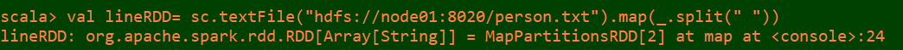

#### 3-定义case class(相当于表的schema)

```scala
case class Person(id:Int, name:String, age:Int)
```

截图：

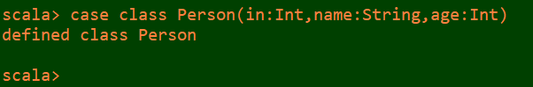

#### 4-将RDD和case class关联

```scala
val personRDD = lineRDD.map(x => Person(x(0).toInt, x(1), x(2).toInt)) 
```

代码截图：

​	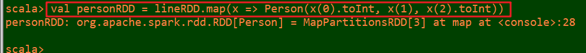

#### 5-将RDD转换成DataFrame

```scala
val personDF = personRDD.toDF 
```

代码截图：

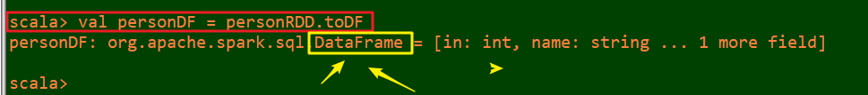

#### 6-查看数据和schema

```scala
personDF.show()
```

代码截图：

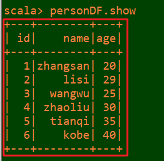

```scala
personDF.printSchema
```

代码截图：

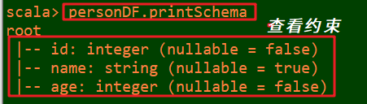

#### 7.注册表

```scala
personDF.createOrReplaceTempView("t_person")
```

代码截图：

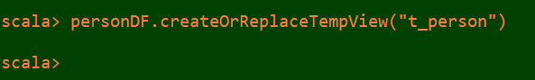

#### 8.执行SQL

spark.sql("select id,name from t_person where id > 3").show

 代码截图：

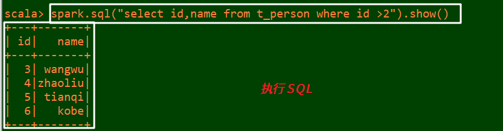

#### 9.也可以通过SparkSession构建DataFrame

```scala
val dataFrame=spark.read.text("hdfs://node01:8020/person.txt") 
```

代码截图：

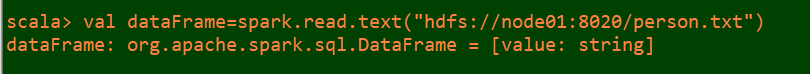

//注意：直接读取的文本文件没有完整schema信息

```scala
dataFrame.show /
```

代码截图：

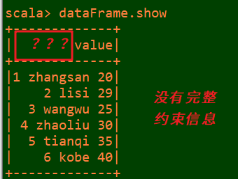

```scala
dataFrame.printSchema 
```

代码截图：

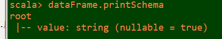

 

###  2-读取json文件

#### 1-数据文件

使用spark安装包下的json文件

查看json文件

```
more /export/servers/spark/examples/src/main/resources/people.json

文件内容:
{"name":"Michael"}
{"name":"Andy", "age":30}
{"name":"Justin", "age":19}
```


#### 2-在spark shell执行下面命令，读取数据

```scala
val jsonDF= spark.read.json("file:///export/servers/spark/examples/src/main/resources/people.json")
```

代码截图：

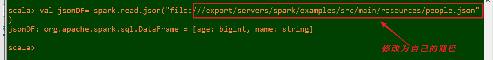

#### 3-接下来就可以使用DataFrame的函数操作      

```scala
jsonDF.show 
```

代码截图：

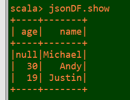

注意:

- ​	直接读取json文件有schema信息，因为json文件本身含有Schema信息，SparkSQL可以自动解析

### 3-读取parquet文件

#### 简介：

```properties
Parquet是一种流行的列式存储格式，可以高效地存储具有嵌套字段的记录，还可以针对相同类型的列进行压缩。

Parquet是语言无关的，而且不与任何一种数据处理框架绑定在一起，适配多种语言和组件，能够与Parquet配合的组件有：

查询引擎: Hive, Impala, Pig, Presto, Drill, Tajo, HAWQ, IBM Big SQL

计算框架: MapReduce, Spark, Cascading, Crunch, Scalding, Kite

数据模型: Avro, Thrift, Protocol Buffers, POJO
```

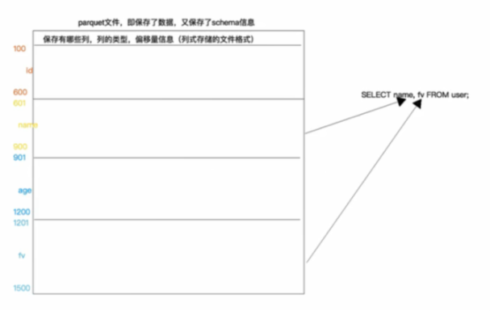

#### 1-数据文件

使用spark安装包下的parquet文件

查看文件

```scala
more /export/servers/spark/examples/src/main/resources/users.parquet
```

代码截图：

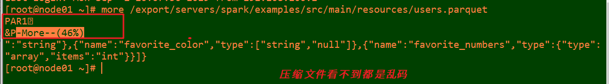

#### 2-在spark shell执行，读取数据

```scala
val parquetDF=spark.read.parquet("file:///export/servers/spark/examples/src/main/resources/users.parquet")
```

代码截图：

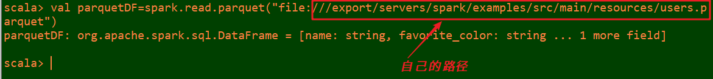

#### 3-使用DataFrame的函数操作

```properties
parquetDF.show 
```

**注意：**

- ​	直接读取parquet文件有schema信息，因为parquet文件中保存了列的信息

代码截图：

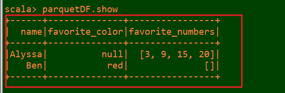

## 3-创建DataSet

#### 1-通过spark.createDataset创建Dataset

```scala
val fileRdd = sc.textFile("hdfs://node01:8020/person.txt") 

val ds = spark.createDataset(fileRdd) 

ds.show
```

代码截图：

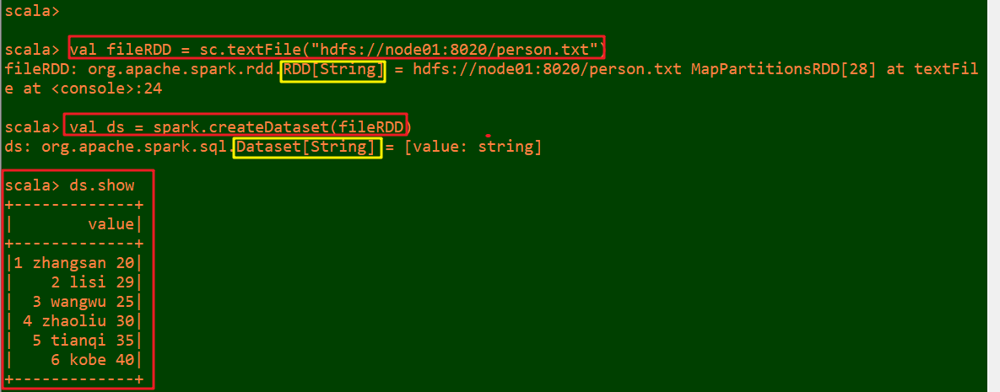

#### 2-通RDD.toDS方法生成DataSet

```scala
case class Person(name:String, age:Int)

val data = List(Person("zhangsan",20),Person("lisi",30)) 

val dataRDD = sc.makeRDD(data)

val ds2 = dataRDD.toDS  

ds2.show
```

 代码截图：

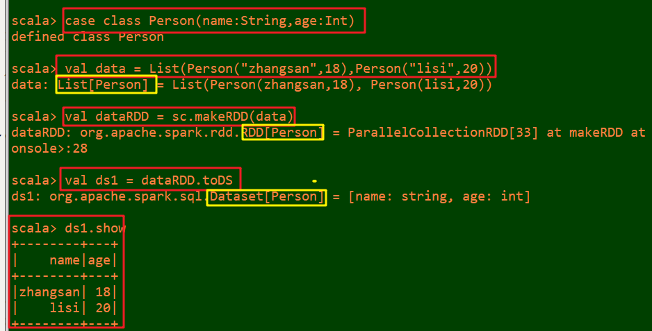

#### 3-通过DataFrame.as[泛型]转化生成DataSet

```scala
case class Person(name:String, age:Long)

val jsonDF= spark.read.json("file:///export/servers/spark/examples/src/main/resources/people.json")

val jsonDS = jsonDF.as[Person] 

jsonDS.show
```

代码截图：

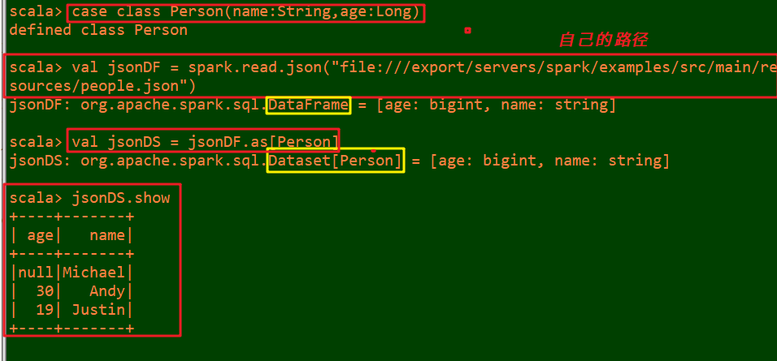

#### 4-DataSet注册成表进行查询

```scala
jsonDS.createOrReplaceTempView("t_person")

spark.sql("select * from t_person").show
```

 代码截图：

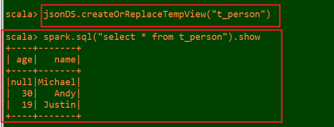

## 4-两种查询风格

### 1.4.1.  准备工作

#### 1-读取文件并转换为DataFrame或DataSet

```scala
val lineRDD= sc.textFile("hdfs://node01:8020/person.txt").map(_.split(" "))

case class Person(id:Int, name:String, age:Int)

val personRDD = lineRDD.map(x => Person(x(0).toInt, x(1), x(2).toInt))

val personDF = personRDD.toDF

personDF.show

//val personDS = personRDD.toDS

//personDS.show 
```

代码截图：

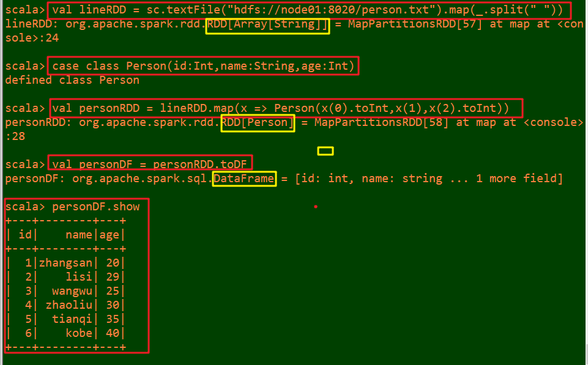

 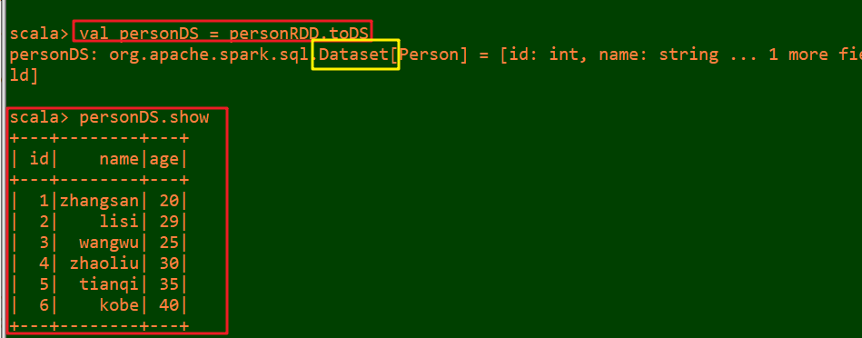

 

### 1.4.2.  DSL风格

SparkSQL提供了一个领域特定语言(DSL)以方便操作结构化数据

#### 1-查看name字段的数据

```scala
personDF.select(personDF.col("name")).show

personDF.select(personDF("name")).show

personDF.select(col("name")).show

personDF.select("name").show
```

代码截图：

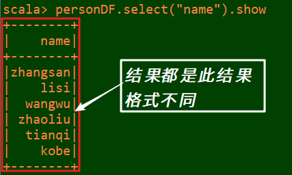

#### 2-查看 name 和age字段数据

```scala
personDF.select("name", "age").show
```

代码截图：

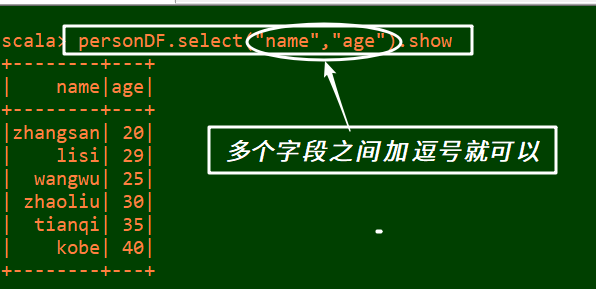

#### 3-查询所有的name和age，并将age+1

```scala
personDF.select(personDF.col("name"), personDF.col("age") + 1).show

personDF.select(personDF("name"), personDF("age") + 1).show

personDF.select(col("name"), col("age") + 1).show

personDF.select("name","age").show

personDF.select($"name",$"age",$"age"+1).show

//错误格式：
personDF.select("name", "age"+1).show 
```

代码截图：

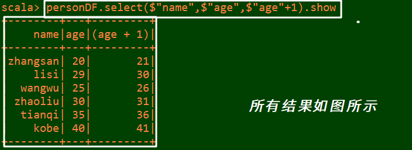

 错误截图：（分析异常）

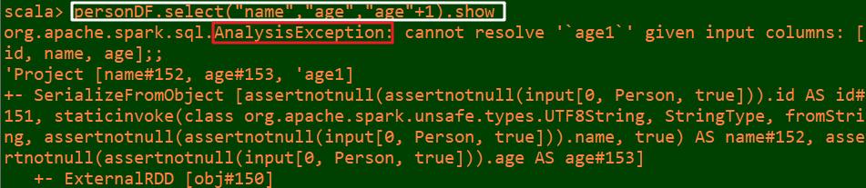

#### 4-过滤age大于等于25的，使用filter方法过滤

```scala
personDF.filter(col("age") >= 25).show

personDF.filter($"age" >25).show
```

 代码截图：

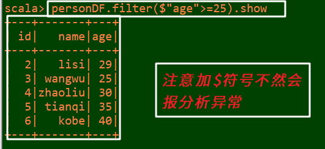

#### 5-统计年龄大于30的人数

```scala
personDF.filter(col("age")>30).count()

personDF.filter($"age" >30).count()
```

代码截图：

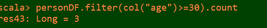

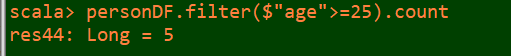

#### 6.-按年龄进行分组并统计相同年龄的人数

```scala
personDF.groupBy("age").count().show
```

代码截图：

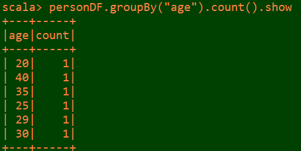

### 1.4.3.  SQL风格

- ​	DataFrame的一个强大之处就是我们可以将它看作是一个关系型数据表，然后可以通过在程序中使用spark.sql() 来执行SQL查询，结果将作为一个DataFrame返回
- 如果想使用SQL风格的语法，需要将DataFrame注册成表,采用如下的方式：

```scala
personDF.createOrReplaceTempView("t_person")

spark.sql("select * from t_person").show
```

代码截图：

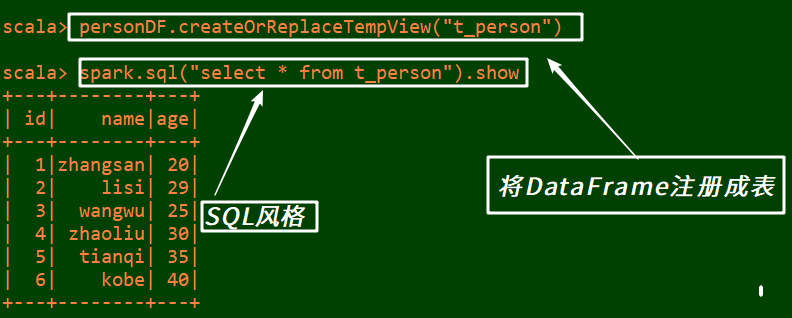

#### 1-显示表的描述信息

```scala
spark.sql("desc t_person").show
```

代码截图：

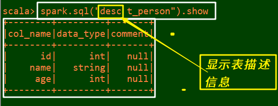

#### 2-查询年龄最大的前两名

```scala
spark.sql("select * from t_person order by age desc limit 2").show
```

代码截图：

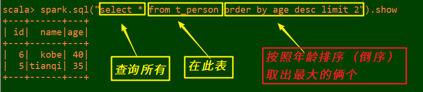

#### 3-查询年龄大于30的人的信息

```scala
spark.sql("select * from t_person where age > 30 ").show
```

代码截图：

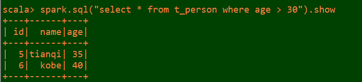

#### 4-使用SQL风格完成DSL中的需求

```scala
spark.sql("select name, age + 1 from t_person").show

spark.sql("select name, age from t_person where age > 25").show

spark.sql("select count(age) from t_person where age > 30").show

spark.sql("select age, count(age) from t_person group by age").show
```

代码截图：同上截图

## 5-总结

1.DataFrame和DataSet都可以通过RDD来进行创建

2.也可以通过读取普通文本创建--没有完整的约束

3.通过josn/parquet会有完整的约束

4.不管是DataFrame还是DataSet都可以注册成表，然后就可以使用SQL进行查询了!